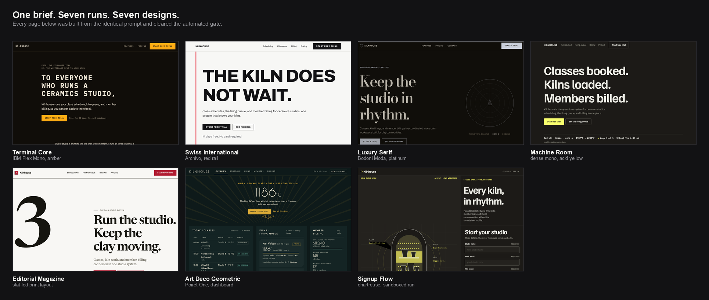
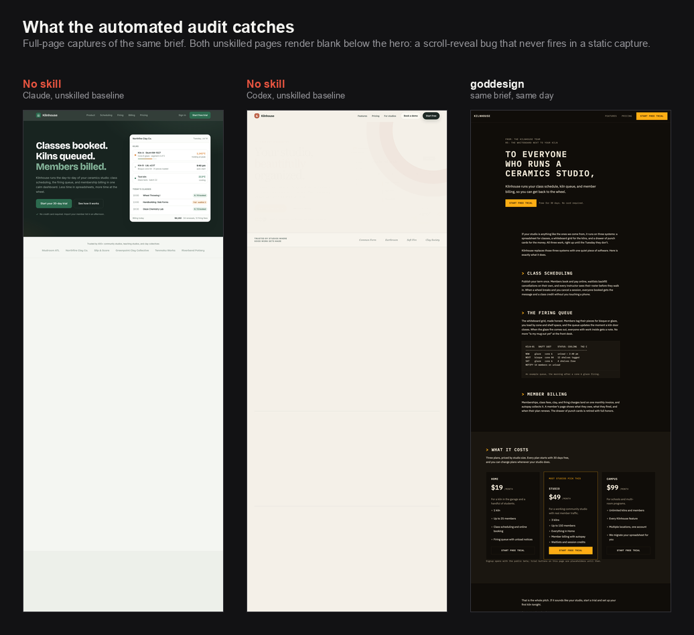

# goddesign

**Stop shipping websites that look like every other AI-built website.**

[](https://github.com/hannsxpeter/goddesigns/releases)
[](LICENSE)
[](docs/INSTALL.md)
[](skills/goddesign/references/checklist.md)
[](validation/runs/kilnhouse-2026-07/README.md)
[](validation/research/sentiment-evidence-2026-07.md)

goddesign is a free, open-source add-on for AI coding assistants. Install it
once, and every web page your assistant builds gets a distinct visual identity,
professional craft, and an automated quality check before it reaches you.

It works with Claude Code and OpenAI Codex CLI today, and with any assistant
that can read a plain markdown skill file.



<sup>Real screenshots from the [Kilnhouse validation run](validation/runs/kilnhouse-2026-07/README.md). Same prompt every time.</sup>

---

## The problem

You ask an AI to build you a landing page. It looks fine. It also looks exactly
like the last four landing pages you have seen: the purple gradient headline,
the cream background with the serif type and the terracotta button, the same
card grid, the same fade-in as you scroll.

People notice. That is the finding behind this project: we collected and
verified 346 public comments about AI-designed websites, and the single loudest
complaint is that these pages are **recognizable on sight**. A design that
announces "a robot made this" undercuts the thing it was supposed to sell.

There are two ways it goes wrong, and they are opposites:

| Failure | What it looks like | Which assistants do it |
|---|---|---|
| **Convergence** | Tasteful, polished, and identical every time. The same fonts, the same palette, the same hero section. | Models with strong design instincts |
| **Literalness** | Nothing invented at all. Browser default buttons, one recycled template, "use gray" left as an unanswered decision. | Models that follow instructions but do not improvise |

Telling an AI "don't make it look AI-generated" does not fix either one. Ban the
purple gradient and it moves to the next most popular look. Variety has to be
built in, not asked for.

## What goddesign does about it

**It rolls the dice, then holds itself to the result.** A small script picks a
complete visual direction from a curated deck (17 aesthetic directions, 12 page
structures, 10 color palettes, 12 typeface pairings), checks it against a
running log so your next project does not repeat your last one, and nudges the
exact colors so two projects that draw the same card still ship different pages.
A model cannot do any of that for itself: asked to pick at random, it picks the
same "random" thing every time, and it does not remember what it built for you
last month.

**It writes the design down before it builds.** Every decision (exact colors,
fonts, spacing, motion, the one signature element) is committed to a plain-text
plan first. Then the code has to match the plan. No drifting halfway through
into the house style.

**It checks its own work, mechanically.** When the page is built, two automated
checks run before you see it:

- A **source scan** reads the code for 32 known problems: banned fonts and
  colors, gradient text, buggy scroll animations that leave the page blank,
  missing keyboard focus outlines, missing reduced-motion support, buzzword
  filler, vague attribution, and formulaic copy.
- A **visual audit** opens the page in a browser at phone, tablet, and desktop
  sizes and takes screenshots. It catches overlapping text, content that never
  appears, horizontal scrollbars, buttons too small to tap, and fonts that
  silently failed to load.

Anything that fails goes back for a bounded round of fixes, with the design plan
frozen so the assistant cannot "fix" a problem by quietly redesigning the page.

**It sizes itself to the task.** A small edit to an existing page gets the rules
and the source scan, nothing more. A new page gets the full treatment. A brief
covering three or more screens first gets a shared design map, so a marketing
site, sign-up flow, and dashboard end up looking like one product.

**It only tells the model what the model needs.** Frontier models already know
type scales, contrast ratios, and modern CSS, so version 2 stopped re-teaching
them: a frontier model now reads about 16 KB of instructions per new page,
where version 1.8 read about 95 KB. Models that execute literally, and smaller
or cheaper ones, still get the fully spelled-out version.

## Who it is for

- **Founders and solo builders** shipping a site with an AI assistant who do not
  want it to look like a template.
- **Product and marketing teams** who need a landing page or dashboard that
  passes as professionally designed, without a design hire.
- **Developers** who can build anything but would rather not make 40 color and
  typography decisions per page.
- **Designers** working with AI who want their existing design system extended
  faithfully instead of reinvented.

You do not need to be a designer to use it. You do need an AI coding assistant.

## Get started

```sh
git clone https://github.com/hannsxpeter/goddesigns.git
sh goddesigns/scripts/install.sh
```

The installer links the skill into Claude Code and Codex, then proves each link
resolves to a complete install. Run `sh goddesigns/scripts/install.sh --check`
any time; re-run it without `--check` if you move the folder.

Then ask for what you want:

```
/goddesign a landing page for a small-batch coffee roaster
```

In Codex the command is `$goddesign`. You can also skip the command entirely:
the skill recognizes design requests on its own ("build me a signup page", "make
this dashboard look better"), and a short note in your assistant's instructions
file makes that automatic every time.

Step-by-step setup, optional extras, and notes for other assistants:
[docs/INSTALL.md](docs/INSTALL.md).

## Does it actually work?

We publish the evidence, including the parts that went against us and the parts
that are not finished.

**What the machinery does, measured.** Seven runs of the same brief produced
seven different, quality-checked designs. Two runs without the skill reproduced
the failures we catalogued, and both rendered as blank pages in screenshots
because of a scroll-animation bug the automated audit caught and human review
had missed. Full write-up with screenshots:
[the Kilnhouse run](validation/runs/kilnhouse-2026-07/README.md).



<sup>That blankness is the actual defect, not a capture error. The page looks
fine while you scroll it and renders empty to anything that does not: a
screenshot tool, a printer, a search crawler, a reader with JavaScript
disabled.</sup>

**The source scan separates the two populations.** Across all 49 pages on file,
it clears 21 of the 31 goddesign pages with zero failures (the other 10 have one
or two), and fails all 18 pages built without it, at 6 to 70 problems each. Read
that for what it is: the scan checks goddesign's own rules, so it shows the
skill obeys itself, not that its pages are better.

**Against a much smaller skill, on appeal, the record is mixed.** In three
rounds judged by the project's owner, Anthropic's own `frontend-design` skill
won two (Ledgerbird, and Wayfare "in every category") and goddesign took first
and second in the third (Bandquarter). All three ran on one day, with the rules
retuned to the owner's verdicts between rounds, so the win shows the taste loop
working, not a general result. The owner also picked the no-skill page as
"really good" without knowing which one it was. Records:
[Ledgerbird](validation/runs/ledgerbird-2026-07/README.md),
[Wayfare](validation/runs/wayfare-2026-07/README.md),
[Bandquarter](validation/experiments/bandquarter-2026-07/README.md).

**What has not been proven.** All of the above is author-run. Whether outside
judges can tell goddesign pages from human-designed ones is the core claim, and
it is **unvalidated**: the study built to test it closed in September 2026 with
no rater responses ([closure record](validation/studies/study-a-2026-07/completion-audit.md)).
Version 2's own bet (that the smaller instruction set costs no quality) has a
pre-registered four-way test with its decision rules fixed in advance:
[validation/studies/lean-core-2026-09](validation/studies/lean-core-2026-09/protocol.md).
A first smoke pair, one brief under each version, passed the same gate and used
18% fewer tokens under version 2; it also caught a lost honesty rule before
release ([record](validation/runs/lean-core-smoke-2026-09/README.md)).

**We retract things.** One test capture was withdrawn in July 2026 after it
turned out to be contaminated, and the finding plus every claim it touched is
recorded in public: [the withdrawal
record](validation/runs/kilnhouse-2026-07/WITHDRAWN-codex-baseline-kilnhouse.md).

Every visual fingerprint rule traces to the 346-comment study or to a defect
caught in a real run. Quality mechanisms adapted from other projects carry a
frozen source, license record, explicit refusals, and repository calibration
under `validation/research/`.

## Common questions

**What does a run cost?**
On a frontier model, a new page reads about 16 KB of instructions (the skill
plus the picker's output), about four thousand tokens; version 1.8 read about
95 KB. An edit to an existing page reads only the 12.7 KB skill file and runs
the source scan. The checks themselves are scripts and cost no model tokens
until they find something.

**Do I need to install anything besides the skill?**
Node 18 or newer runs the picker and the checks. The visual audit also uses a
headless browser if one is available; without it, the skill says plainly that it
skipped that check rather than pretending it passed.

**Will it override my company's existing design system?**
No. If your project already has a design system, goddesign switches into
extension mode: it reads your existing colors, fonts, and spacing, and builds
within them instead of inventing a new look.

**Does it send my code anywhere?**
No. The checks run locally. No network, no accounts, no external service is
required for a design run.

**Can it make images and illustrations?**
Yes, when a page genuinely needs them, though most designs deliberately ship
none. Image generation goes through the Codex CLI and ChatGPT's built-in image
tool. If that is not available, the page falls back to the hand-coded artwork
the chosen direction already specifies.

**Can it inspect or remove AI provenance marks?**
Only when you explicitly ask, and only after the design has passed its gate.
goddesign then hands your own deliverable to the independent
[`remove-ai-marks`](https://github.com/guillaumemeyer/watermarks-remover)
skill. That companion is not needed for ordinary design, and its absence never
lowers the design score.

**Will every page look wild?**
No. Each page takes exactly one deliberate risk and keeps the rest disciplined.
"Distinct" is the goal, not "loud".

**Is it locked to one AI vendor?**
No. It is a markdown file with a few small scripts. Any assistant that reads
markdown skills can run it.

## A quick glossary

Terms you will see in the output and in the deeper docs:

- **Direction lock**: the written design plan, decided before any code, that the
  finished page is graded against.
- **The deck**: the curated set of directions, layouts, palettes, and font
  pairings the skill picks from.
- **The picker**: the script that rolls the seed, applies the run logs, and
  prints the one direction and layout this run gets.
- **Lane**: how much of the skill a model reads. Frontier models get the lean
  core; literal and smaller models also get the full enumeration.
- **The sweep**: the automated scan of the code for known problems.
- **The audit**: the automated check of the rendered page in a real browser.
- **The gate**: the sweep and the audit together, plus a look at the screenshots.
  A page either clears it or gets fixed.
- **Design map**: the shared plan for a project with three or more screens.

## What is in this repository

| Path | What it is |
|---|---|
| `skills/goddesign/SKILL.md` | The skill itself: the lean core every run reads |
| `skills/goddesign/references/` | The full lane, the decks (17 directions, 12 layouts, 10 palettes, 12 font pairings), motion, copy review, imagery, the design map, and the long-form checklist |
| `skills/goddesign/scripts/` | The picker, the source scan, the visual audit, token extraction, the design-map validator, the install check, and helpers |
| `scripts/` | Repository tooling: the installer, the deck lint, the test suites, and the four-way comparison harness |
| [`validation/`](validation/README.md) | The evidence library: research, protocols, experiments, comparison runs, and studies |
| `docs/` | Setup guide and the technical architecture |
| `.github/` | CI: install integrity, deck lint, and every test suite on Node 18 and 22 |

## Documentation

- [Setup guide](docs/INSTALL.md): installation, requirements, per-assistant notes
- [Architecture](docs/ARCHITECTURE.md): how and why each mechanism works, in detail
- [Contributing](CONTRIBUTING.md): the evidence bar for new rules, how to add deck rows
- [Changelog](CHANGELOG.md): release history

## License

[MIT](LICENSE). Free to use, free to modify, free to ship commercially.
